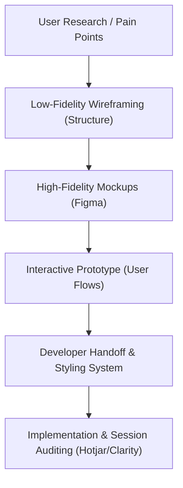

# UI/UX Reference Guide for Ledger

This document serves as a long-term design specification and playbook for the user interface (UI) and user experience (UX) standards of Ledger. It outlines established conventions, educational resources, and approved developer tools.

---

## 1. Core Visual & UX Conventions

The Ledger application follows strict rules to ensure a premium feel, balance data density, and handle mobile-first responsiveness:

### A. The Transaction Register Layout

- **Desktop Viewport (Grid Details):** Preserves full 14-column spreadsheet data density. Table column headers support interactive sorting (`Paid Date`, `Account`, `Amount`, etc.). A top filter bar enables querying by text search, account, category, budget, and reconciliation status.
- **Mobile Viewport (Summary Cards):** Hides the spreadsheet table to prevent horizontal overflow. Renders a simplified, vertical stream of transaction cards showing _Payee, Date, Account name, Category pill, Running Balance, Cleared status, and Amount_.
- **Expanded Rows & Cards:** Tapping a table row (desktop) or card (mobile) expands it to display notes, invoice date, unique transaction ID, and action buttons (`Flag`, `Clear`, `Reconcile`).

### B. Form Presentation (Ingestion & Creation)

- **Responsive Contexts:** Form windows must dynamically morph based on the screen width:
  - **Desktop Viewport (>= 768px):** Rendered as a centered modal container (`Dialog` component).
  - **Mobile Viewport (< 768px):** Rendered as a draggable, slide-up sheet (`Drawer` component) optimized for quick, one-handed thumb interaction.
- **Type-Aware Inputs:** Form fields must adjust depending on the selected transaction type (e.g., transfers hide category selectors; income forms hide budget envelopes).

### C. Design Tokens & Styling

- **Colors:** Palette parameters are defined using OKLCH variables (see [globals.css](file:///Users/kevin/Documents/antigravity/ledger/app/globals.css)). Accent borders use neutral tones, flagged rows use light amber tones, and credits use emerald/green text.
- **Typography:** Strict sans-serif font rendering with monospace (`tabular-nums`) numbers for financial alignment in registers and summaries.

---

## 2. Top UI/UX Developer Resources

For learning why design systems work and how to build interfaces without custom styling expertise:

- **Refactoring UI** (by Steve Schoger & Adam Wathan): Practical rules for visual hierarchy, white space, sizing, and contrast without abstract design theory.
- **Laws of UX** ([lawsofux.com](https://lawsofux.com)): Cognitive rules dictating user expectations. Focus on:
  - _Hick's Law:_ Show fewer fields initially to make entry faster (e.g., type-aware forms).
  - _Jakob's Law:_ Align budgeting and transaction flows with existing tools (e.g., YNAB or Copilot).
- **Apple Human Interface Guidelines (HIG)**: Reference guides for mobile gestures, bottom-sheet heights, safe areas, and transition animations.

---

## 3. Recommended Design & Quality Systems

For expanding the UI or designing new pages, professionals use these tools and components:

- **v0 by Vercel** ([v0.dev](https://v0.dev)): Generative UI system that builds clean React components styled with Tailwind CSS from simple text prompts.
- **shadcn/ui** ([ui.shadcn.com](https://ui.shadcn.com)): Accessible, copy-paste React component primitives built on Radix and Base UI.
- **Coolors** ([coolors.co](https://coolors.co)): Balanced color palette generator.
- **Microsoft Clarity / Hotjar:** Session recorders that allow you to analyze real user interactions to locate layout friction or tap confusion.

---

---

---

# UI/UX Overhaul & Optimization Guide for Ledger

This document serves as a strategic playbook and resource catalog for upgrading the user experience (UX) and user interface (UI) of the Ledger PWA. It covers educational resources, design methodologies, professional workflows, and developer-centric tools.

---

## 1. Top UI/UX Learning Resources

If you want to understand _why_ designs work and _how_ to build them as a software developer, focus on these tactical resources:

### Developer-Focused UI/UX Design

- **Refactoring UI** (by Steve Schoger & Adam Wathan):
  - _What it is:_ The absolute best guide for developers. It bypasses abstract design theory and teaches concrete rules (e.g., "use color weight instead of size for hierarchy", "avoid gray borders — use background colors to separate sections").
- **Laws of UX** ([lawsofux.com](https://lawsofux.com)):
  - _What it is:_ A collection of cognitive psychology laws that dictate user behavior. Key laws for Ledger:
    - _Hick's Law:_ More choices lead to longer decision times (relevance: keep forms type-aware, show only necessary fields).
    - _Fitts's Law:_ Target elements (buttons) must be easy to acquire (relevance: larger tap targets on mobile).
    - _Jakob's Law:_ Users expect your app to work like other apps they know (relevance: align budget layouts with standard YNAB/Copilot patterns).

### Design Guidelines & Specs

- **Material Design 3** ([m3.material.io](https://m3.material.io)): Great for understanding interaction states (active, focused, hovered, disabled) and structural grids.
- **Apple Human Interface Guidelines (HIG)** ([developer.apple.com/design/human-interface-guidelines](https://developer.apple.com/design/human-interface-guidelines)): Explains premium feel, micro-animations, bottom navigation bar safe areas, and gesture overlays.

### Visual Design & Layout Inspiration

- **Godly** ([godly.website](https://godly.website)): Curated modern websites showcasing high-end interactions, typography, and layout transitions.
- **Mobbin** ([mobbin.com](https://mobbin.com)): Over 100,000 screenshots of real-world mobile and web apps (like Monarch, Copilot, CashApp, and YNAB) showing actual user onboarding, transaction registers, and budget forms.
- **Land-book** ([land-book.com](https://land-book.com)): Premium design directory for dashboards and landing page layouts.

---

## 2. Professional Design Workflow (How the Pros Do It)

Professionals do not start coding immediately when designing a UI. They separate **thinking/designing** from **programming**:

### Steps & Methods:

1.  **Define a Visual Style Guide:** Focus on typographic scales, scale intervals (4px, 8px, 12px, 16px grids), shadow levels, and a tailored HSL palette (dark slate backgrounds, emerald/green for gains, crimson/red for flags).
2.  **Prototype in Figma:** Drag and drop ready-made component libraries (e.g., Untitled UI or Tailwind UI Figma kit) to mock up screens. This lets you inspect spacing, sizes, and layout choices visually in minutes rather than hours of code tweaks.
3.  **Audit real sessions:** Once deployed, professionals use tools like **Microsoft Clarity** or **Hotjar** (free tiers) to record user sessions. Seeing a user repeatedly tap a non-clickable element or struggle to find the "Confirm" button is the fastest way to discover UX issues.
4.  **A/B Testing & Peer Critique:** Share design screenshots on communities like Twitter/X, Dribbble, or specialized design subreddits (`r/UIUX`, `r/design`).

---

## 3. Recommended Overhaul Methods for Ledger

Given Ledger's specific pages (Dashboard, `/register` table, `/plan` envelope budget, and forms), here are recommended UX improvements:

### A. The `/register` Table (Reducing Cognitive Load)

Currently, a 14-column spreadsheet is highly functional but visually overwhelming on standard screens.

- **Responsive Collapsing Columns:** Hide columns like `invoice_date`, `reference_num`, `source`, and `cleared` by default on standard screens.
- **Row-Expand details:** Clicking a row should expand it smoothly (using CSS height transitions) to show full metadata, notes, and attachment previews in an elegant card format.
- **Visual Status Indicators:** Replace text flags with subtle icons (e.g., a small orange flag ⚑ for `flagged`, a green checkmark ✓ for `reconciled` / `cleared`).

### B. Mobile Navigation & Interactive States

- **Glassmorphism & Depth:** Use backdrop blur filters (`backdrop-blur-md bg-white/80`) on mobile sheets and modal backgrounds to create visual depth.
- **Bottom Sheets over Modals:** On mobile, instead of a centering box modal, use a **Bottom Slide-Up Sheet** (standard iOS/Android pattern) for transaction entry.
- **Interactive Micro-Animations:** Add transitions to hover states (e.g., a tiny scale-up or opacity shift on buttons) and smooth slide-ins for lists.

---

## 4. Systems and Apps to Elevate UI/UX Quality (Developer Tools)

If you are not a designer, you do not need to create UI components from scratch. Use these tools to get professional results automatically:

### Generative UI Systems

- **v0 by Vercel** ([v0.dev](https://v0.dev)):
  - _What it is:_ A generative AI tool. Type a prompt (e.g., _"a modern dark-mode transaction register list for a mobile finance app, styled with Tailwind v4, showing debit/credit, category tags, and an expand button"_). It outputs beautiful React code using Tailwind classes. You can copy-paste this directly into your app.

### Copy-Paste Component Libraries

- **shadcn/ui** ([ui.shadcn.com](https://ui.shadcn.com)):
  - _What it is:_ The standard for modern React apps. It is not an installed dependency; instead, you copy code for pre-designed, fully accessible components (Modals, Tables, Select Dropdowns, Popovers) directly into your workspace.
- **Tailwind UI** ([tailwindui.com](https://tailwindui.com)):
  - _What it is:_ Premium, professionally designed component templates built by the creators of Tailwind CSS. Excellent for landing page sections, application shells, and dashboards.

### Design Tools

- **Figma** ([figma.com](https://figma.com)): Essential for mocking up layouts. Use a free Tailwind UI Figma file as a starting kit.
- **Coolors** ([coolors.co](https://coolors.co)): Generates curated color palettes that are mathematically balanced, ensuring you never select harsh or mismatched colors.
